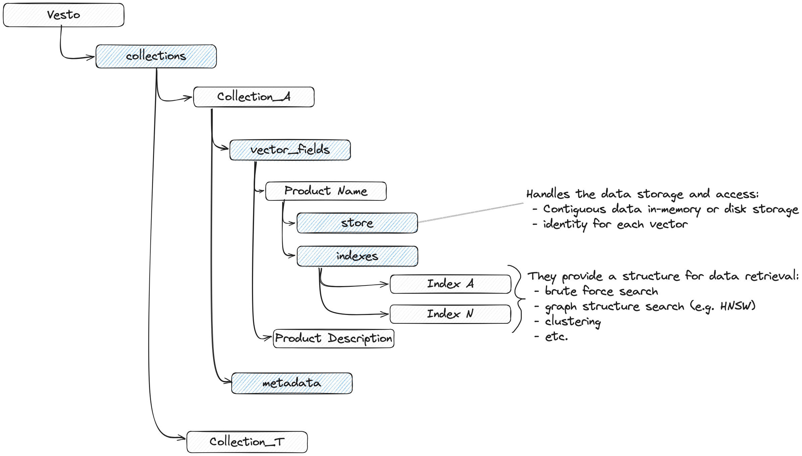

# Vesto

Playing with **Vector Store** algorithms.
## Usage

```python
from vesto import Vesto

db = Vesto()

collection = db.add_collection("docs", "embedding", "cosine", 2)

collection.add_index("hnsw_idx", "hnsw")

ids = collection.insert(
    [
        [1.0, 0.0],
        [0.0, 1.0],
    ]
)

# len(db) counts collections
assert len(db) == 1
assert ids == [0, 1]  # insert returns the minted EntityIds as u64s

# search takes the index name, returns (score, vector) pairs.
results = collection.search("hnsw_idx", [1.0, 0.0], 1)

score, vector = results[0]
assert vector == [1.0, 0.0]  # nearest to [1,0] is itself

```

```sh
# Build

# cd vesto
cargo build # build all workspaces
cargo test -p vesto-core # test the vesto core package

# cd vesto-python
# You should be in a python-venv here 
maturin develop # build and install the python package
pytest # run python tests
```

## Layout

- `vesto-core/` — the storage and search engine, in Rust.
  - `lib.rs` — `Vesto`, a registry of named collections.
  - `collection.rs` — `Collection`: a schema, a store, and its indexes.
  - `store.rs` — `VestoStore`: id -> vector storage, with save/load to disk.
  - `index.rs` — `VestoIndex` trait implemented by each index type.
  - `flat.rs` — `VestoFlatIndex`: brute-force search over all vectors.
  - `hnsw.rs` — `VestoHNSWIndex`: Hierarchical Navigable Small World search.
  - `metrics.rs` — distance metrics (`L2`, `Cosine`).
  - `types.rs` — shared types (`EntityId`, `Vector`, `Score`).
  - `error.rs` — `VestoError`.
- `vesto-python/` — PyO3 bindings exposing `Vesto` and `VestoCollection` to Python.

## Concepts

<p align="center">
 
</p> 

- **Collection**: a named set of vectors sharing a schema (dimension, vector field name, metric). Holds a `VestoStore` and any number of named indexes.
- **Store**: the source of truth mapping `EntityId -> Vector`. Indexes query it rather than duplicating vector data.
- **Index**: a pluggable search strategy over a collection's store. Currently only `flat` (brute force) is implemented.


Algorithms:

- FLAT: Brute force loop over all vectors in a collection.
- HNSW: Hierarchical Navigable Small World - An implementation from the paper (with Heap based search-layer alg. 2)

Plugin:

- Python: PyO3 bindings (`vesto-python`) mirroring the Rust API — `Vesto`, `add_collection`, `add_index`, `insert`, `search`.

Note:

- In-memory store, with binary save/load to disk (`VestoStore::save` / `load`).

## TODO

Being a playground on vector DBs, there are a lot of cool features I can think of:

- IVF index
- Proper vector field support
- GPU support
- MMAP store (*e.g.* to support DBs larger than the RAM)
- HNSW index - improve knn and bulk inserts
- Packaging (python, rust)
- Packaging cloud (docker, k8s)
- etc.